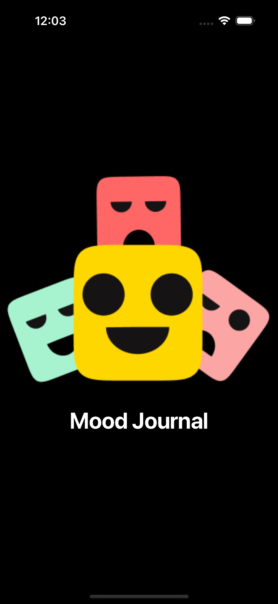

# Mood Tracker Assessment - Flutter App

<div align="center">
   
   </div>

<p>
  Welcome to <strong>Mood Tracker</strong>, a comprehensive mobile application designed to help users monitor their emotional well-being through daily mood tracking, journaling, and a rewarding gamification system. The app provides seamless authentication, multilingual support, and dynamic theming for an enhanced user experience.
</p>
The design inspirations came from this:<a href="https://www.figma.com/design/gAbcAeDXePqsVboQyHHhFZ/Mood-Tracker--Community-?node-id=32-10&t=ggqminiCUVvt8jyx-0">
Figma user </a> and also from this<a href="https://dribbble.com/shots/22029102-Mood-Tracking-Application"> Dribble page </a>

<sub>Built by <a href="https://www.linkedin.com/in/nkpozi-marcel/">Nkpozi Marcel Kelechi </a> || <a href="https://twitter.com/_Captured_Heart"> (X: @Captured-Heart)</a></sub>

# Demo Video

<div align="center">
  
</div>

This project demonstrates the following Flutter development practices: clean architecture, state management with Riverpod, local data persistence with Hive, and modern UI animations.

## Demo Features Overview

<div align="left">
- <strong>Authentication Flow:</strong> Complete user registration/login system with validation and secure storage<br/>
- <strong>Mood Tracking:</strong> Daily mood selection with visual feedback and calendar integration<br/>
- <strong>Journal Management:</strong> Create, edit, delete journal entries with mood associations<br/>
- <strong>Rewards & Gamification:</strong> Point system, achievement badges, and progress tracking<br/>
- <strong>Localization:</strong> Switch between English and German languages seamlessly<br/>
- <strong>Theme Management:</strong> Light, Dark, and System theme modes with user preferences<br/>
- <strong>API Demo:</strong> Integration with OpenLibrary API showcasing REST operations<br/>
- <strong>Offline Support:</strong> Local data persistence with Hive for offline functionality<br/>

</div>

---

## Getting Started

After cloning this repository:

### FVM setup

The app runs on:

- **Flutter:** >=3.29.0
- **Dart:** >=3.7.0 <4.0.0

Install `fvm` if not already installed:

```bash
dart pub global activate fvm
```

Install the local `flutter` version:

```bash
fvm install
```

### Dependencies Installation

```bash
flutter clean && flutter pub get
```

### Run the Application

```bash
flutter run
```

---

# Key Features

## 🔐 Authentication System

- **User Registration & Login** with email validation
- **Secure Storage** using flutter_secure_storage
- **Session Management** with persistent user data
- **Form Validation** with custom validators

## 😔🥳😭😆 Mood Tracking

- **Visual Mood Selection** (Awesome, Good, Sad, Horrible)
- **Daily Mood Limits** - One mood entry per day
- **Calendar Integration** with table_calendar for mood history
- **Mood Statistics** and trend visualization

## 📝 Journal Entries

- **Rich Text Journaling with Moods** with mood associations
- **CRUD Operations** - Create, Read, Update, Delete entries

## 🏆 Rewards & Gamification

- **Point System** based on mood entries (Awesome: 10pts, Good: 5pts, etc.)
- **Achievement Badges** (Bronze, Silver, Gold, Platinum)
- **Progress Tracking** with statistics dashboard
- **Reward Notifications** with confetti animations

## 🌍 Internationalization

- **Multi-Language Support** (English, German)
- **Dynamic Language Switching** with persistent preferences
- **Easy Localization Integration**

## 🎨 Dynamic Theming

- **Three Theme Modes:** Light, Dark, System
- **Persistent Theme Preferences** using Hive storage

## 🔗 API Integration

- **REST API Demo** with OpenLibrary integration
- **Network Connectivity** checking
- **Error Handling** with retry mechanisms
- **Loading States** and user feedback

## UI Screenshots

### Light Theme Screenshots

<div style="text-align: center">
  <table>
    <tr>
      <td style="text-align: center">
        
      </td>
      <td style="text-align: center">
        
      </td>
      <td style="text-align: center">
        
      </td>
      <td style="text-align: center">
        
      </td>
    </tr>
    <tr>
      <td style="text-align: center">
        
      </td>
      <td style="text-align: center">
        
      </td>
      <td style="text-align: center">
        
      </td>
      <td style="text-align: center">
        
      </td>
    </tr>
  </table>
</div>

### Dark Theme Screenshots

<div style="text-align: center">
  <table>
    <tr>
      <td style="text-align: center">
        
      </td>
      <td style="text-align: center">
        
      </td>
      <td style="text-align: center">
        
      </td>
      <td style="text-align: center">
        
      </td>
    </tr>
    <tr>
      <td style="text-align: center">
        
      </td>
      <td style="text-align: center">
        
      </td>
      <td style="text-align: center">
        
      </td>
      <td style="text-align: center">
        
      </td>
    </tr>
  </table>
</div>

## Technical Architecture

### State Management

- **Flutter Riverpod** for reactive state management
- **AsyncNotifier** for handling async operations
- **Provider composition** for dependency injection

### Data Persistence

- **Hive Database** for local data storage
- **Custom Adapters** for data serialization
- **Secure Storage** for sensitive information

### Project Structure

```
lib/
├── constants/          # App constants and enums
├── hive_helper/       # Database configuration
├── src/
│   ├── data/         # Controllers and repositories
│   ├── domain/       # Entities and repository interfaces
│   └── presentation/ # UI components and views
└── utils/            # Utility functions
```

## Tools & Packages

### Core Dependencies

- **[flutter_riverpod](https://pub.dev/packages/flutter_riverpod)**: State management solution
- **[hive](https://pub.dev/packages/hive)**: Local database for data persistence
- **[easy_localization](https://pub.dev/packages/easy_localization)**: Internationalization support
- **[dio](https://pub.dev/packages/dio)**: HTTP client for API calls
- **[table_calendar](https://pub.dev/packages/table_calendar)**: Calendar widget for mood history

### UI & Animation

- **[flutter_animate](https://pub.dev/packages/flutter_animate)**: Rich animations
- **[flutter_slidable](https://pub.dev/packages/flutter_slidable)**: Swipe actions for list items
- **[confetti](https://pub.dev/packages/confetti)**: Celebration animations

### Utilities

- **[flutter_secure_storage](https://pub.dev/packages/flutter_secure_storage)**: Secure data storage
- **[uuid](https://pub.dev/packages/uuid)**: Unique identifier generation
- **[internet_connection_checker_plus](https://pub.dev/packages/internet_connection_checker_plus)**: Network connectivity

## Development Patterns

- **Clean Architecture** with clear separation of concerns
- **Repository Pattern** for data abstraction
- **MVVM Pattern** with Riverpod state management
- **Dependency Injection** for testable code
- **Error Handling** with custom result types

## Contributing

1. Fork the repository
2. Create your feature branch (`git checkout -b feature/AmazingFeature`)
3. Commit your changes (`git commit -m 'Add some AmazingFeature'`)
4. Push to the branch (`git push origin feature/AmazingFeature`)
5. Open a Pull Request

---

<div align="center">
  <p>Made with 💜 by <strong>Nkpozi Marcel Kelechi</strong></p>
  <p>
    <a href="https://twitter.com/_Captured_Heart">Twitter</a> •
    <a href="https://github.com/Captured-Heart">GitHub</a> •
    <a href="https://www.linkedin.com/in/nkpozi-marcel/">LinkedIn</a> •
    <a href="https://medium.com/@captured_heart">Medium</a>
  </p>
</div>
